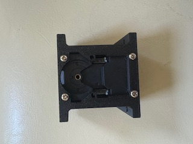
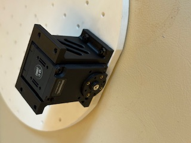
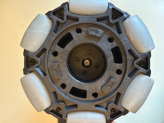
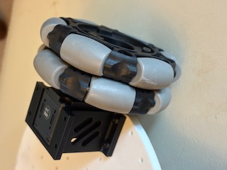
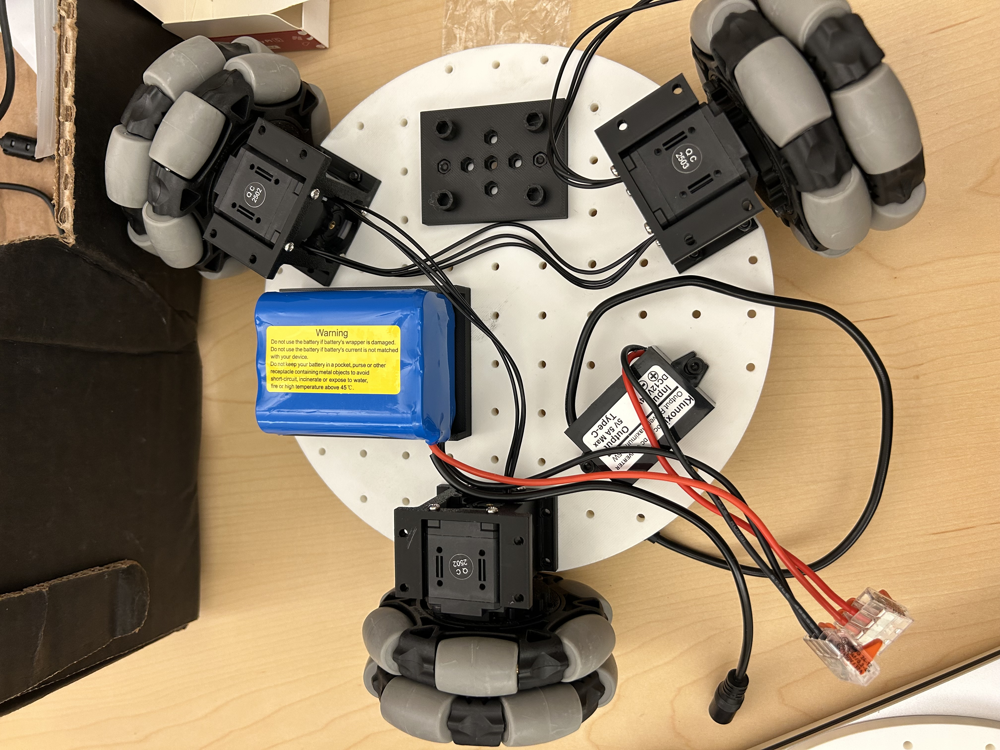
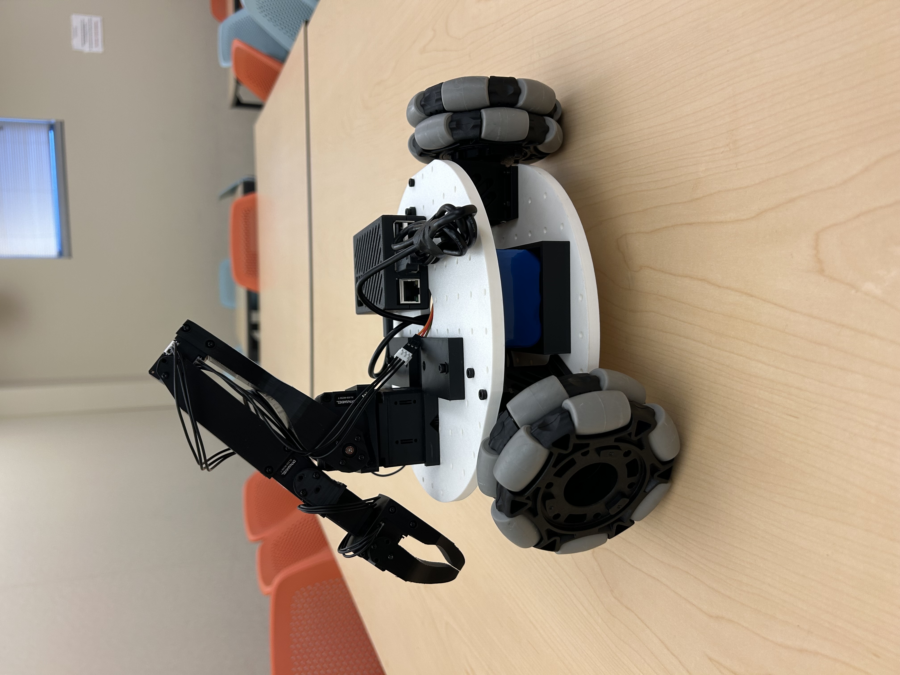

# Assembly
> **Estimated time:** 2 hours

*Exact component placements can be visualized in the [Fusion360 Online CAD](https://a360.co/4iD2gtf)*

*We assume you already have a [Koch Arm](https://github.com/jess-moss/koch-v1-1) built*
### 1. Assemble Wheel Modules (3 per robot)

1. Attach the drive motor to the motor mount using 4 m2x5 tap screws.

    

2. Screw the drive motor mount onto the bottom base plate using 4 m3x12 machine screws.

    

3. Attach the wheel hub to the omniwheel using 2 m4x12 machine screws.

    

4. Attach the wheel hub to the servo horn using 4 m3x16 machine screws.

    
    

### 2. Bottom Plate Assembly
1. Insert m3 nuts into the mounts for the servo controller and battery mounts. Screw both onto the bottom base plate with 4 m3x12 machine screws.

2. Add the servo driver and attach the wires to the 3 drive servos.

    
3. Wiring Electronics
   -    Use the wago lever connectors to connect the ground and power battery wire leads to the leads of the 12v->5v converter and the dc barrel plug adapter. Screw on the 12v to 5v converter to the bottom base plate with 2 m3x16 machine screws and 2 m3 nuts.

         

### 3. Top plate Assembly
1. Place the raspberry pi 5 into the pi case bottom and snap on the top part of the case. 
2. Attach the Pi to the top base plate using 2 m3x12 machine screws and mount the SO-101 arm with 4 m3x20 machine screws. Using our modified SO-101 base or the original will work as there are holes for both in the plate.

    

### 4. Final Assembly
1. Feed the servo controller usb-c to usb-a, 5v usb-c power, and SO0-101 servo wires through the hole in the top base plate. 

    

2. Mount the top base plate onto the motor mounts using 4 m3x12 machine screws.

    

### 5: Attach Cameras
*Note: The mounts we designed are specific to the cameras we chose. They may need to be modified for different camera modules.*
#### (Option 1) Mounting Arducam
For these [camera's](https://www.amazon.com/Arducam-Camera-Computer-Without-Microphone/dp/B0972KK7BC) you can print these parts 1x `3DPrintMeshes/base_camera_mount.stl` 
1. Screw the base camera mount onto the bottom base plate(attach the arducam 5MP wide angle camera to the mount with 2 m2.5x12 machine screws). The cable for the camera mount can also be fed through the cutout

    

### Plug everything in and its ready!
Power the electronics by plugging in the DC barrel plug adapter to the servo motor controller and the 5v usb-c connector to the raspberry pi 5. The usb cables from the servo controller and the cameras can directly be plugged in to the raspberry pi.

 
